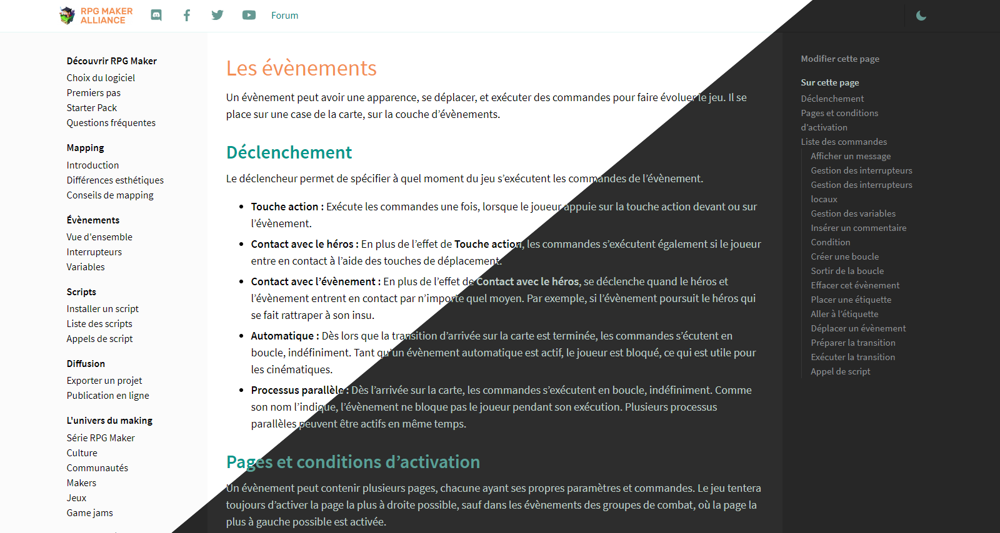

# Royal Theme for Hugo



This is a port of the [Sphinx theme of the same name](https://github.com/Princesseuh/sphinx-royal-theme) I made for the French RPG Maker community RPG Maker Alliance (RMA). Even though Hugo is mostly used for blogs, it does documentations pretty well!

The theme is responsive and should work on every platform. However it is centered and has a fixed max width. The theme is currently available in English and French (see the i18n folder)

You can see a live example running at [wiki.rpgmakeralliance.com](https://wiki.rpgmakeralliance.com)

## Installation

Clone the repo inside the themes folder of your Hugo installation like so :

```bash
cd themes
git clone https://github.com/princesseuh/hugo-royal-theme
```

Alternatively you can add the theme as a [Git Submodule](https://git-scm.com/book/en/v2/Git-Tools-Submodules), making it easier for other users to pull your repo.

Then in your site's `config.toml`, set the theme like so :

```toml
theme = "hugo-royal-theme"
```

And there you go! You should now have a working installation using this beautiful theme. Check below for more information on how to enable and customize all of its features.

## Configuration

This theme does not require any specific setting to work, however certain features are disabled if certain files or parameters are missing. Unlike the Sphinx version, there's no RMA branded assets included in the theme

### Menus

Royal uses [Hugo's Menus](https://gohugo.io/content-management/menus/) feature to generate the header and left sidebar menus (the right sidebar is automatically generated from the table of content)

For the header, the menu is called `global`. You can populate it by editing your `config.toml` file like so :

```toml
[[menu.global]]
name = "Website"
weight = 1
identifier = "website"
url = "https://princesseuh.net"

[[menu.global]]
name = "Twitter"
weight = 2
identifier = "twitter"
url = "https://twitter.com/VanillaHoys"

```

The header menu currently doesn't support parents and submenus.

For the left sidebar, the menu is called `docs`. Like for the header, you can populate it by editing the `config.toml`, however only childs will actually be clickable (there is currently no way to change this)

So for instance, to add a link through the config file you need to do it like so :

```toml
[[menu.docs]]
name = "GitHub Links"
identifier = "meta"

[[menu.docs]]
name = "Source Code"
parent = "meta"
url = "https://github.com/princesseuh/hugo-royal-theme"
```

Which will result in this :


(The GitHub icon is automatically added to GitHub links in the left sidebar)

To add a menu entry through a page's front matter, see [this page](https://gohugo.io/content-management/menus/#add-content-to-menus) from the Hugo documentation


### Adding a logo

Simply put an image called `logo.png` in `{SITE_ROOT}/static/assets/`. The theme will automatically use it for the header instead of writing the website name

### Adding a favicon

Like for the logo, Royal checks if a file called `favicon.png` exists in `{SITE_ROOT}/static/assets/`. The theme currently does not support having multiple formats and sizes for favicon unfortunately

### "Edit this page" link

The Edit this page link (both in the sidebar and in the shortcode) requires `editURL` to be set in the params section of your `config.toml` file. Like so :

```toml
[params]
editURL = "https://github.com/rpgmakeralliance/wiki/edit/master/content"
```

The current page link will be appended to this link, so make sure it point to your content folder without a trailling slash!


### SEO

#### OpenGraph Icon

Unless a page-specific OpenGraph icon is specified (see [Specify an OpenGraph icon](#specify-an-opengraph-icon)), Royal will automatically use a file called `default_opengraph.png` located in `{SITE_ROOT}/static/assets/` if it exist.

Currently, for Twitter Cards, the `summary` type of card is hardcoded in `baseof.html`


#### Twitter Handler

In your site `config.toml` file, simply add

```toml
[social]
twitter = "YOUR_TWITTER_HANDLE"
```

## Page Parameters

A few parameters are supported to disable certain features or change the opengraph icon on a per page basis

### Disable the "Edit this Page" link

Add `editthispage: false` to your page's front matter

### Disable the right sidebar

Add `onthispage: false` to your page's front matter

### Specify an OpenGraph icon

Add `og_image: "{IMAGE_URL}"` to your page's front matter

### Limit Table of Content depth

Add `tocmaxdepth: {DEPTH}` to your page's front matter. Only values from 1 to 5 are currently supported

Unfortunately it's not yet possible in Hugo to limit the Table of Content depth natively so we had to do it through CSS (which is why it's limited to specific values)

## Licenses

This theme is distributed under the MIT license. You can see the details [here](LICENSE)

### External Resources
- [Normalize.css by Nicolas Gallagher](https://github.com/necolas/normalize.css) under license MIT
- [Dark Mode Icon by Rami McMin](https://www.flaticon.com/free-icon/moon-phase-outline_53381) under license [CC 3.0 BY](https://creativecommons.org/licenses/by/3.0/)
- [Source Sans Pro font by Adobe](https://fonts.google.com/specimen/Source+Sans+Pro) under the [Open Font License](http://scripts.sil.org/cms/scripts/page.php?site_id=nrsi&id=OFL_web)
- Various icons (menu, permalinks, external links etc) from [Font-Awesome](https://fontawesome.com/) built into a custom bundle using [Fontello](http://fontello.com/)
